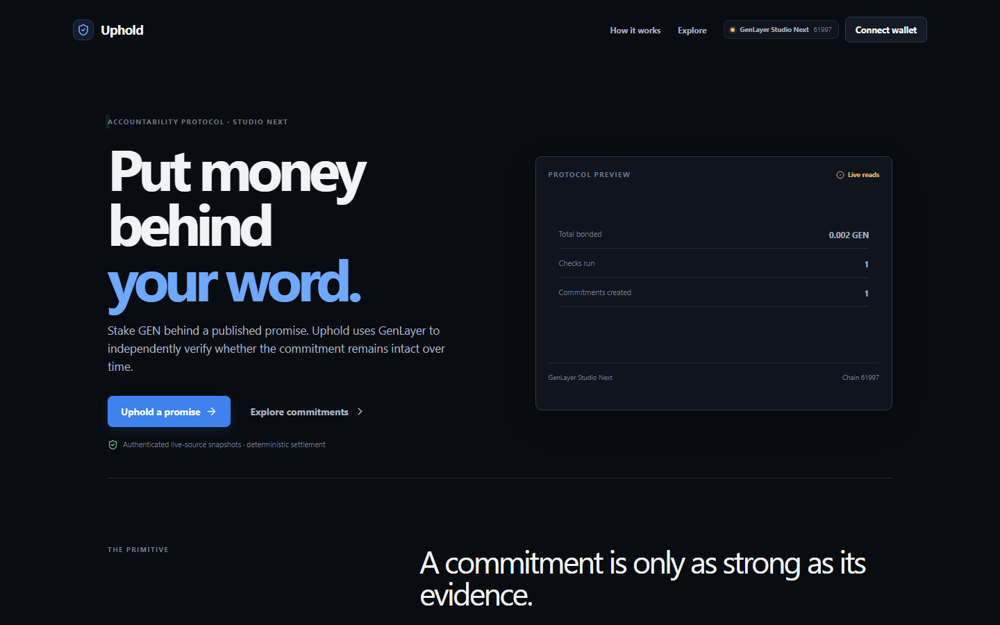
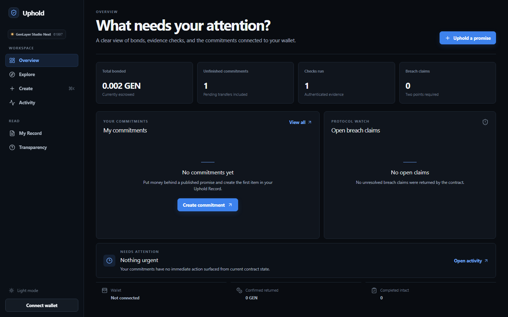
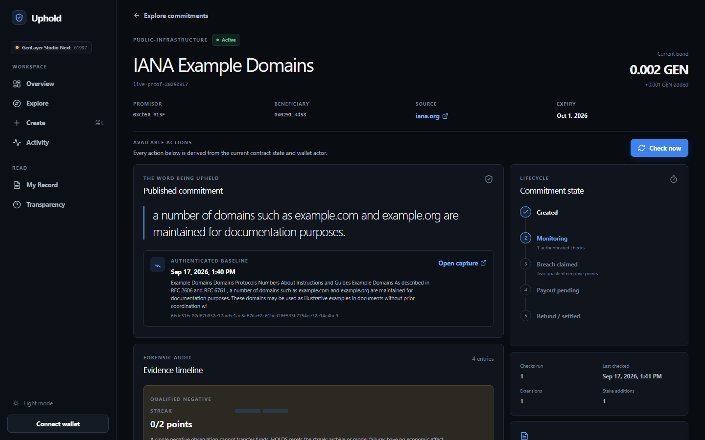
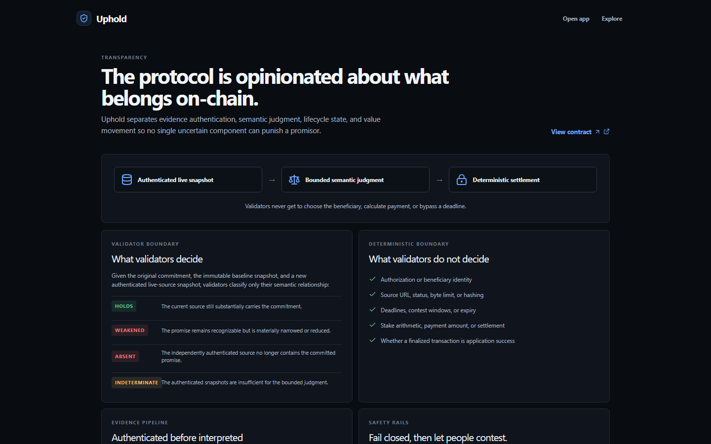

  

<h1 align="center">Uphold</h1>

<strong>Put money behind a public promise.</strong>

GEN-backed commitments with authenticated live-source evidence and bounded semantic judgment on GenLayer.

  <a href="https://uphold-sable.vercel.app">Live App</a> ·
  <a href="docs/ARCHITECTURE.md">Architecture</a> ·
  <a href="PROVENANCE.md">Deployment</a> ·
  <a href="evidence/studio-next/uphold-live-proof.json">Verification</a> ·
  <a href="https://explorer-studio-dev.genlayer.com/address/0x51A1B4eFC6Be539C54C642515d3c537dd2D3e528">Contract</a>

## What Uphold is

Uphold turns a public promise into an enforceable economic commitment. A promisor publishes exact wording, names a public source, and stakes GEN behind the promise. GenLayer validators independently capture that source, authenticate the response, and assess whether a later authenticated snapshot still carries the commitment.

The contract keeps the boundary explicit: validators provide evidence capture and a bounded semantic classification; deterministic contract logic controls authorization, immutable commitment fields, timing, stake, breach thresholds, contests, transfer requests, and accounting.

## Uphold at a glance

| Area | Verified implementation |
| --- | --- |
| Track | Agentic Commerce Infrastructure |
| Category | Project |
| Network | GenLayer Studio Next |
| Chain ID | 61997 |
| Canonical contract | 0x51A1B4eFC6Be539C54C642515d3c537dd2D3e528 |
| Evidence model | Live public source → independent validator capture → immutable authenticated snapshot |
| Judgment model | Bounded semantic comparison over authenticated stored snapshots |
| Verdict set | HOLDS · WEAKENED · ABSENT · INDETERMINATE |
| Stake asset | GEN |
| Transaction safety | Persisted same-hash reconciliation; no blind rebroadcast |
| Frontend | Next.js 16 · React 19 · TypeScript |
| Live proof state | ACTIVE · two authenticated snapshots · HOLDS · 0.002 GEN |

## Contents

- [Why Uphold](#why-uphold)
- [Why GenLayer](#why-genlayer)
- [Core design principles](#core-design-principles)
- [How Uphold works](#how-uphold-works)
- [Trust model](#trust-model)
- [Evidence model](#evidence-model)
- [Architecture](#architecture)
- [Commitment lifecycle](#commitment-lifecycle)
- [Snapshot authentication](#snapshot-authentication)
- [Semantic judgment](#semantic-judgment)
- [Breach and contest model](#breach-and-contest-model)
- [Accounting model](#accounting-model)
- [Transaction safety](#transaction-safety)
- [Final verified deployment](#final-verified-deployment)
- [End-to-end live proof](#end-to-end-live-proof)
- [Security properties](#security-properties)
- [Application](#application)
- [Technology](#technology)
- [Verification and testing](#verification-and-testing)
- [Repository structure](#repository-structure)
- [Local development](#local-development)
- [Verify Uphold in 5 minutes](#verify-uphold-in-5-minutes)
- [Limitations](#limitations)
- [Status](#status)

## Why Uphold

Many commitments are public but not natively machine-verifiable. A promise may live on a public webpage, change over time, and require interpretation rather than a single numeric oracle value. Uphold connects the promise to a source, the source to authenticated snapshots, and the snapshots to a bounded protocol outcome.

The design is intentionally conservative. Evidence is authenticated before it is interpreted, semantic output is limited to four classifications, and uncertain infrastructure or model results do not become breach evidence. The economic consequences remain deterministic and auditable.

## Why GenLayer

Deterministic contracts are good at balances, authorization, timestamps, and state transitions. They cannot independently retrieve a changing natural-language webpage and determine whether its meaning still matches an original public commitment.

GenLayer provides the validator-backed boundary required for that question:

~~~text
authentication
    → immutable snapshot
    → bounded semantic judgment
    → deterministic state consequences
~~~

Validators independently capture the public source and compare the stored baseline with the later authenticated snapshot. Consensus selects the classification; consensus does not authenticate evidence by itself. The contract only accepts the defined verdict set:

- HOLDS
- WEAKENED
- ABSENT
- INDETERMINATE

## Core design principles

| Principle | Uphold implementation |
| --- | --- |
| Authenticate before adjudicating | The live response is bounded, hashed, length-counted, normalized, and stored before semantic assessment. |
| Immutable evidence snapshots | Baseline and later snapshots are stored in the commitment history and are not caller-editable. |
| Narrow validator authority | Validators classify the relationship between the commitment and authenticated snapshots; they do not select beneficiaries or calculate payments. |
| Fail closed | Source outages, inaccessible responses, invalid evidence, validator disagreement, and malformed semantic output do not become ABSENT. |
| Two-point breach threshold | WEAKENED or ABSENT must be observed in two distinct consecutive qualified checks before a breach claim opens. |
| No blind rebroadcast | A timeout preserves the operation hash for reconciliation; it never authorizes a second broadcast. |
| Finality is not execution success | A finalized transaction is accepted only after the SDK success predicate and expected execution result pass. |
| State readback establishes reality | Every write proof reads the affected commitment, history, ledger, or address record after finalization. |
| Infrastructure failure is not semantic absence | Capture and model failures are recorded as infrastructure outcomes, not negative promise classifications. |

## How Uphold works

~~~mermaid
flowchart LR
    P[Promisor] -->|GEN stake + exact public commitment| C[Uphold commitment]
    C --> B[Authenticated baseline snapshot]
    S[Live public source] --> V[Independent validator capture]
    V --> B
    B --> L[Immutable snapshot history]
    L --> J[Bounded semantic comparison]
    J --> G[GenLayer consensus]
    G --> E[Guarded deterministic contract consequence]
    E --> A[Stake and accounting state]
~~~

The normal evidence path does not require Wayback or CDX. Those services are optional off-chain research or recovery tools only; the authoritative protocol path is live capture, authenticated storage, and assessment from stored snapshots.

## Trust model

Uphold separates responsibilities:

1. The browser and wallet prepare a user-approved transaction.
2. GenLayer validators retrieve the named public source and produce bounded capture data.
3. The contract authenticates and stores the snapshot, then accepts only the bounded semantic result.
4. Deterministic contract code applies timing, stake, breach, contest, and accounting rules.
5. The frontend reads finalized state and displays the record; it is not the source of truth.

No validator can choose the beneficiary, alter immutable commitment fields, bypass a deadline, or directly move stake. A semantic result is not a payment instruction.

## Evidence model

The authoritative model is:

~~~text
live public source
    → independent validator capture
    → immutable authenticated snapshot
    → semantic assessment from the stored snapshot
~~~

Each stored snapshot includes the source URL, capture timestamp, HTTP status, internally derived SHA-256, exact byte length, bounded normalized content, captured-state marker, and classification where one has been reached. The later semantic assessment receives the original commitment, the stored baseline, and the newly stored authenticated snapshot.

## Architecture

~~~mermaid
flowchart TB
    Browser[Uphold browser frontend]
    Wallet[Wallet + Transaction Kit]
    Contract[Uphold intelligent contract]
    Validators[GenLayer validator execution]
    Source[Public HTTPS source]
    Snapshots[Immutable snapshot history]
    Lifecycle[Stake, timing, contests, transfer requests, accounting]

    Browser -->|read views| Contract
    Browser -->|one approved write| Wallet
    Wallet -->|fee quote + broadcast| Contract
    Contract -->|nondeterministic capture request| Validators
    Validators -->|bounded web retrieval| Source
    Validators -->|authenticated capture + semantic result| Contract
    Contract --> Snapshots
    Contract --> Lifecycle
    Lifecycle -->|state readback| Browser
    Snapshots -->|baseline + later snapshot| Validators
~~~

The frontend is a thin client: no backend, database, private indexer, or fake protocol state is used. The contract source, deployment record, lifecycle proof, and raw operation receipts are retained in this repository.

## Commitment lifecycle

The following states and transitions are the ones implemented by contracts/uphold.py:

~~~mermaid
stateDiagram-v2
    [*] --> ACTIVE: create_commitment
    ACTIVE --> ACTIVE: check HOLDS / infrastructure failure
    ACTIVE --> ACTIVE: increase_stake / extend_commitment
    ACTIVE --> BREACH_CLAIMED: two qualified negatives
    BREACH_CLAIMED --> CONTESTED: contest_breach
    CONTESTED --> ACTIVE: adjudicate_contest HOLDS
    CONTESTED --> BREACH_CONFIRMED: adjudicate_contest WEAKENED or ABSENT
    BREACH_CLAIMED --> BREACH_CONFIRMED: contest window elapses
    BREACH_CONFIRMED --> PAYOUT_PENDING: settle_breach
    BREACH_CLAIMED --> PAYOUT_PENDING: settle_breach after window
    ACTIVE --> REFUND_PENDING: expire_commitment after expiry
~~~

INDETERMINATE, validator disagreement, and capture failures leave economic state unchanged. PAYOUT_PENDING and REFUND_PENDING represent requested external EOA transfers; completion is observed outside the contract and is not live-demonstrated in the current proof.

## Snapshot authentication

The contract derives the snapshot digest from the captured response bytes and derives byte length internally. It bounds the response before storage, stores normalized content for the semantic prompt, and assigns an immutable sequence identifier such as live-proof-20260917:0 or live-proof-20260917:1.

The baseline fields are copied into the commitment at creation and are never replaced by a later check. Later snapshots append to history, so the proof can show the exact baseline and the exact later observation that informed a classification.

## Semantic judgment

The semantic question is deliberately narrow: given the original commitment, the authenticated baseline, and the authenticated later snapshot, classify their relationship as HOLDS, WEAKENED, ABSENT, or INDETERMINATE.

Only the classification is consensus-critical. A short excerpt and reason are stored for audit context, but they cannot choose a beneficiary or override deterministic contract rules. A model or validator failure is not converted into ABSENT.

## Breach and contest model

WEAKENED and ABSENT are qualified negative observations. One qualified negative only increments the consecutive negative count. A second distinct consecutive qualified negative opens BREACH_CLAIMED and a contest window. HOLDS resets the negative streak. INDETERMINATE has no economic effect.

The promisor can contest using another snapshot already stored for the original source. adjudicate_contest applies the same bounded semantic comparison. If the contest is upheld, the commitment returns to ACTIVE. If qualified negative evidence remains, it becomes BREACH_CONFIRMED. Settlement requests a beneficiary transfer; expiry requests a promisor refund. Neither payout nor refund completion is claimed as live proof here.

## Accounting model

The contract tracks deposited GEN, currently escrowed GEN, pending outflows, pending payout/refund buckets, paid beneficiary amounts, and returned promisor amounts separately. In the live proof there was no settlement or refund:

~~~text
total_deposited = 0.002 GEN
total_escrowed = 0.002 GEN
total_pending_outflows = 0
total_paid_to_beneficiaries = 0
total_returned_to_promisors = 0
~~~

The live invariant is therefore final total_escrowed = final total_deposited = final commitment current_stake, with no pending or completed transfer. Address records expose objective counters such as commitments created and bonded amount; they are not universal trust scores.

## Transaction safety

Every lifecycle write follows:

~~~text
PRECONDITION READ
    → LIVE FEE QUOTE
    → BROADCAST ONCE
    → PERSIST HASH
    → RECONCILE SAME HASH
    → FINALIZED
    → EXECUTION SUCCESS
    → STATE READBACK
~~~

The SDK distinguishes finalization from successful execution. If polling becomes ambiguous, the same hash is preserved and reconciled. A timeout, transient RPC failure, or unexpected classification never triggers a blind retry.

## Final verified deployment

| Field | Value |
| --- | --- |
| Network | GenLayer Studio Next |
| Chain ID | 61997 |
| RPC | https://studio-next.genlayer.com/api |
| Contract | 0x51A1B4eFC6Be539C54C642515d3c537dd2D3e528 |
| Deployment transaction | 0x187a259c1763c762409be1c8c294b5a2b8b76b09dca7bd0a737760f16ce9a3f4 |
| Deployed source commit | 2064950cfe1ee353772df6027e1660326e83c792 |
| Source SHA-256 | 3DDFAA229BF36B7D8F06B70FE6E1B4582D004A3FFEDAF08E154834B54819FD3F |
| Contract version | live-snapshot-v1.0 |
| Runner | py-genlayer:5jycge4q8k23462jtb0b9fyey1s9qz928sz2nbrd9mg4sxqg2qng |

The deployed source was read back and matched byte-for-byte. Deployment proof is retained in deployments/studio-next/uphold-corrected.json.

## End-to-end live proof

Commitment live-proof-20260917 uses the stable public source https://www.iana.org/help/example-domains. The baseline snapshot and later snapshot both contain 6639 bytes and the later semantic result is HOLDS.

| Step | Method / result | Transaction |
| --- | --- | --- |
| Create | Baseline snapshot stored; ACTIVE | 0x651fab5959bc6228a9df3a16f4185eb7793e7bf085d7613b44dd50be492a969d |
| Check | Later snapshot stored; HOLDS | 0xcc8c1d43edad2068c79184f5da0b0fc9fe8bbeb1f177c31b2135145f31bba1b5 |
| Increase | Stake increased by 0.001 GEN | 0xbd09e3a0cac0e3b045f0dfa8555056a1b72bc10e40312e8554feded2b19a3cbe |
| Extend | Expiry moved forward | 0x75788a94725bcbb134709d4478702c08321d508f711f71530e6fe2888f0eaeef |
| Final state | ACTIVE · 2 snapshots · 1 check · 0.002 GEN | — |

Full state readback, semantic evidence, fee observations, and raw receipt accounting are in [evidence/studio-next/uphold-live-proof.json](evidence/studio-next/uphold-live-proof.json) and evidence/studio-next/live-operations/.

## Security properties

| Property | Status | Evidence boundary |
| --- | --- | --- |
| Snapshot content is internally hashed | LIVE DEMONSTRATED | Baseline and later live snapshots expose the same recorded SHA-256. |
| Byte length is internally derived | LIVE DEMONSTRATED | Both live snapshots record 6639 bytes. |
| Baseline is immutable | LIVE DEMONSTRATED | Later check appended sequence 1 while sequence 0 remained unchanged. |
| Historical snapshots are immutable | PROVEN | Snapshot records are stored by sequence and not replaced by later caller input. |
| Semantic judgment uses authenticated stored snapshots | LIVE DEMONSTRATED | The HOLDS check used the stored baseline and later snapshot. |
| Infrastructure failures fail closed | TESTED LOCALLY | Direct Mode and contract branches cover unavailable/inaccessible/invalid evidence. |
| Weakening threshold requires qualified observations | TESTED LOCALLY | Direct Mode covers two distinct consecutive WEAKENED/ABSENT points. |
| Accounting invariant | LIVE DEMONSTRATED | Deposited, escrowed, current stake, and zero transfer buckets agree. |
| Pending payout/refund separation | PROVEN | Separate contract fields and status paths exist; completion is external. |
| No blind transaction rebroadcast | TESTED LOCALLY | Frontend same-hash reconciliation and lifecycle tooling preserve hashes. |
| Source/deployment parity | LIVE DEMONSTRATED | Deployed source readback matches the required SHA and byte parity. |
| Breach, contest, settlement, expiry/refund | NOT YET LIVE DEMONSTRATED | No natural safe live fixture was exercised. |

## Application

The application is a read-through view over the real Studio Next contract. It exposes the overview, public commitment explorer, detail/evidence timeline, activity history, Uphold Record, and transparency methodology.

### Dashboard

The dashboard reads the live ledger and shows total bonded GEN, checks, commitment count, and open breach claims. With no wallet connected, the personal section remains honestly empty while protocol-wide counts remain live.

### Live commitment detail

The detail view presents the real IANA commitment, current 0.002 GEN bond, authenticated baseline, four-entry history, HOLDS classification, and extended expiry.

### Transparency

The transparency page explains what validators decide and what deterministic contract logic retains: source identity, snapshot bounds, deadlines, stake arithmetic, and settlement guards.

## Technology

- Uphold intelligent contract in Python with GenLayer v0.6 rc5 compatibility
- Next.js 16 App Router, React 19, TypeScript, and Tailwind CSS
- genlayer-js and Transaction Kit RC2 for reads, fee quotes, wallet submission, reconciliation, and state confirmation
- Studio Next RPC at https://studio-next.genlayer.com/api
- No backend, database, fake indexer, or fabricated chain statistics

## Verification and testing

The final verified regression baseline is:

| Gate | Result |
| --- | --- |
| Frontend tests | 34/34 PASS |
| Uphold Direct Mode | 46/46 PASS |
| Total Direct Mode | 91/91 PASS |
| AST lint | PASS |
| Semantic validation | PASS |
| GenVM lint | PASS |
| Typecheck/lint | PASS |
| Production build | PASS |
| Contract SHA-256 | 3DDFAA229BF36B7D8F06B70FE6E1B4582D004A3FFEDAF08E154834B54819FD3F |

Useful local checks:

~~~shell
npm test
npm run lint
npm run build
wsl.exe -d Ubuntu -- bash -lc 'cd /path/to/Uphold && export GENVM_VERSION=v0.6.0-rc5; genvm-lint check contracts/uphold.py --json'
~~~

The machine-readable lifecycle proof is retained rather than summarized only in this README.

## Repository structure

~~~text
contracts/uphold.py             authoritative Uphold intelligent contract
tests/direct/                    Direct Mode and evidence regression tests
frontend/app/                   Next.js routes
frontend/components/uphold/     Uphold application UI
frontend/lib/uphold/             typed client, actions, normalization, hooks
frontend/fee-profile.json       measured Studio Next fee profile
docs/assets/readme/             real release screenshots
evidence/studio-next/            deployment and lifecycle proof
deployments/studio-next/         deployment manifests and receipts
tools/studio-next/               lifecycle and verification tooling
docs/ARCHITECTURE.md             system and trust-boundary architecture
docs/UPHOLD_PROTOCOL.md          protocol reference
PROVENANCE.md                    audit-oriented release provenance
~~~

## Local development

Requirements: Node 24.x, npm, Python 3.12 or 3.13 for contract tests, and the GenLayer CLI.

~~~shell
npm ci
Copy-Item frontend/.env.example frontend/.env
npm run dev
~~~

The public defaults target Studio Next and the canonical contract. The frontend reads chain state and never fabricates commitment, transaction, or evidence data.

## Verify Uphold in 5 minutes

1. Clone https://github.com/GIFTEDLOV/uphold and enter the repository.
2. Confirm contracts/uphold.py hashes to 3DDFAA229BF36B7D8F06B70FE6E1B4582D004A3FFEDAF08E154834B54819FD3F.
3. Run npm ci and npm run dev.
4. Open Explore and the live-proof-20260917 detail page.
5. Compare the visible HOLDS result, 0.002 GEN stake, snapshot history, and expiry with evidence/studio-next/uphold-live-proof.json.

For a deeper audit, compare the deployed source and deployment transaction in PROVENANCE.md, then inspect the raw receipt records.

## Limitations

- Breach and contest are not live-demonstrated with a natural source change.
- Beneficiary payout and promisor refund/expiry are not live-demonstrated.
- Studio Next does not fully prove production Ghost/EVM semantics.
- External payout completion remains observed off-contract.
- The production UI is verified through HTTP, bundle, and RPC read checks; interactive browser automation was unavailable in this environment.

## Status

Uphold is publicly released on GitHub with a verified Studio Next contract and an end-to-end positive lifecycle proof. The canonical public application is [uphold-sable.vercel.app](https://uphold-sable.vercel.app). No claim is made that breach, settlement, or expiry has been demonstrated live.
