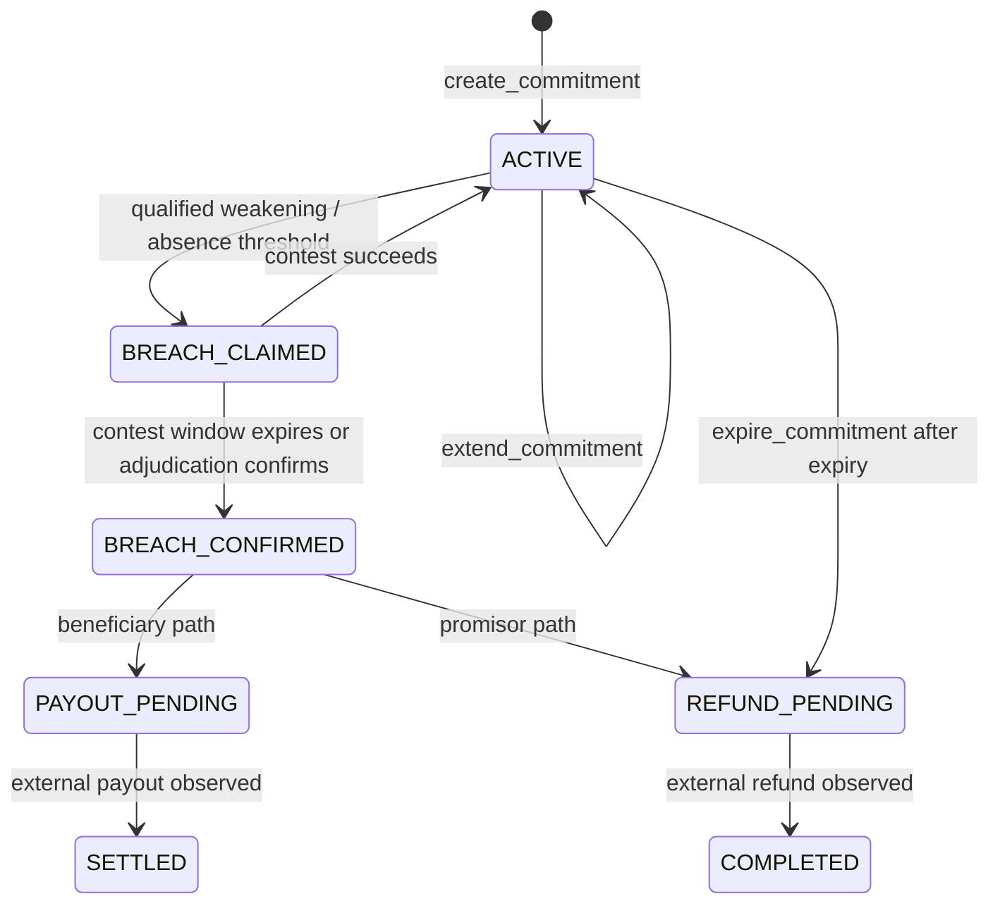

# Uphold architecture

Uphold turns a public promise into a bounded, auditable commitment. The contract holds GEN, records the immutable commitment terms, authenticates live public-source snapshots, and applies deterministic lifecycle rules to validator-backed semantic findings.

## System components

| Component | Responsibility |
| --- | --- |
| Browser frontend | Reads contract state, prepares calls, displays evidence and lifecycle history. It is not the source of truth. |
| Wallet / transaction kit | Signs user-authorized writes and exposes transaction progress. |
| Uphold intelligent contract | Owns commitment terms, snapshot history, verdict handling, stake arithmetic, timing, contests, settlement states, expiry and accounting. |
| GenLayer validators | Independently retrieve public HTTPS content and reach bounded semantic judgments through consensus. |
| Public source | The external page whose current content is captured; no authentication or JavaScript dependency is required by the live proof source. |
| Snapshot storage | Contract state containing the source URL, capture metadata, SHA-256, exact byte length, normalized content and semantic result. |

The current V1.2 candidate targets canonical GenLayer Studio-dev at `https://studio-dev.genlayer.com/api`, chain `61997`, and has source SHA-256 `EC4BD059AC218BA3E9151EE34C6B41F8810B371FF95F9A153B1D0BCB98EBB71C`. Its single hosted deployment attempt finalized with `FINISHED_WITH_ERROR` / `invalid_contract runner malformed`, so no V1.2 address is authoritative and no frontend promotion was made.

The historical V1.1 deployment remains preserved at `0x23786A52b62DC489A5f69653dedD68d1fc56c231` on the historical Studio Next alias. Its source SHA-256 is `090BA710374AC156B8D2CA72001E20F1CDA8482F5530A7C8570357F847D2A1F8` and it reports version `live-snapshot-v1.1`.

## Trust boundaries

The public web is untrusted and mutable. A caller can nominate a URL and promise, but cannot supply arbitrary evidence bytes to the contract. Validator retrieval is nondeterministic infrastructure; it is admitted only through the contract's authenticated capture path. Semantic judgment is bounded to `HOLDS`, `WEAKENED`, `ABSENT`, or `INDETERMINATE` and cannot choose beneficiaries or directly move funds.

Consensus establishes the validator-backed result; it does not itself authenticate the evidence. Authentication comes from the capture operation storing the source response and its internal digest and byte length. A contest captures the same locked HTTPS source fresh into a distinct `<commitment>:contest:<nonce>` namespace as `AUTHENTICATED` / `UNASSESSED`; adjudication is bound to that exact immutable snapshot. Deterministic contract logic then applies authorization, timing, breach thresholds and accounting consequences.

## Evidence capture and snapshot identity

The current authoritative model is:

```text
live public source
  -> independent validator capture
  -> immutable authenticated snapshot
  -> semantic assessment from the stored snapshot
```

`create_commitment` captures the baseline. `check_commitment` captures the later observation and assesses the stored snapshot. Each snapshot records its sequence, capture time, source URL, SHA-256, exact byte length, normalized content, and any bounded semantic finding. The baseline and historical snapshots are immutable after admission. Wayback/CDX is not required for normal operation.

## State transitions

The contract's lifecycle constants are:



The live proof exercised `ACTIVE`, authenticated baseline and later snapshots, a `HOLDS` check, a stake increase, and an expiry extension. Breach, contest, payout, and refund paths remain documented limitations because they were not naturally live-demonstrated.

## Semantic consensus

The semantic layer answers only whether the stored later observation supports one of four findings:

| Finding | Meaning |
| --- | --- |
| `HOLDS` | The captured public evidence still supports the commitment. |
| `WEAKENED` | The evidence no longer fully supports the commitment, but is not a clear absence. |
| `ABSENT` | The commitment is not present in the captured evidence. |
| `INDETERMINATE` | The evidence or infrastructure is insufficient for a reliable semantic conclusion. |

Infrastructure failure is not converted into `ABSENT`; the contract fails closed. A breach requires the protocol's qualified observations and threshold rules rather than a single arbitrary caller assertion.

## Stake accounting and contest flow

The contract separates deposited/escrowed stake from pending outflows and paid or returned totals. The live positive-path invariant is:

```text
total_deposited = total_escrowed + total_pending_outflows
                 + total_paid_to_beneficiaries + total_returned_to_promisors
```

Before settlement or expiry, the live proof showed the full `0.002 GEN` stake as escrowed, with pending outflows, paid beneficiary totals, and returned promisor totals at zero. A claimed breach may be contested. Adjudication and timing determine whether a confirmed breach becomes a payout or refund request. Completion of the external transfer remains observed off-contract; Studio Next does not by itself prove production Ghost/EVM payout semantics.

## Transaction lifecycle

Every write follows the operational safety invariant:

```text
PRECONDITION READ
  -> LIVE FEE QUOTE
  -> BROADCAST ONCE
  -> PERSIST HASH
  -> RECONCILE SAME HASH
  -> FINALIZED
  -> EXECUTION SUCCESS
  -> STATE READBACK
```

Polling ambiguity never authorizes a second broadcast. A transaction hash is preserved and reconciled. Finality and execution success are separate checks, and expected state readback establishes the observed result.

## Historical V1.1 deployment context

The historical V1.1 release was deployed on the Studio Next alias, chain `61997`, with the `py-genlayer:5jycge4q8k23462jtb0b9fyey1s9qz928sz2nbrd9mg4sxqg2qng` runner dependency. The deployment transaction is `0x50c4b9ba6daa08e23eee1926bafc9fddc2b23d9c2afed971cc4fb26e16348a3f4`; the source commit is `536346f00f158f374f6e5e28112a0fc06a9065a4`.

## Verification artifacts

- Deployment proof: [`deployments/studio-next/uphold-hardening.json`](../deployments/studio-next/uphold-hardening.json)
- Live lifecycle proof: [`evidence/studio-next/uphold-hardening-live-proof.json`](../evidence/studio-next/uphold-hardening-live-proof.json)
- Fee profile: [`frontend/fee-profile.json`](../frontend/fee-profile.json)
- Protocol detail: [`UPHOLD_PROTOCOL.md`](UPHOLD_PROTOCOL.md)
